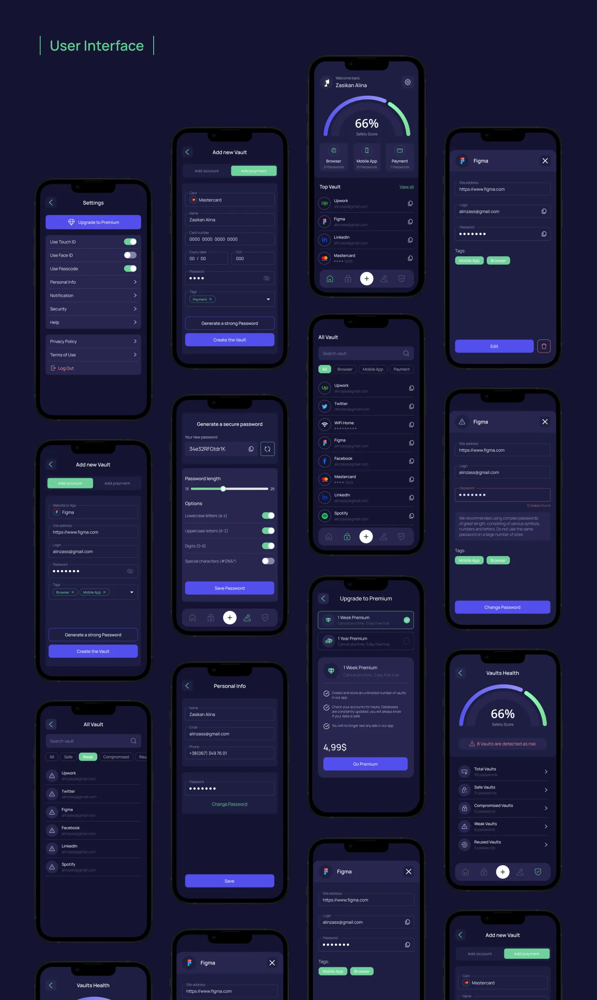

# 🔐 Password Manager App (Flutter UI + MVC Architecture)

> A modern and secure **Password Manager App** built with **Flutter**, following the **MVC architecture pattern**.  
> The app lets you safely store, organize, and generate strong passwords — all wrapped in a stunning **dark-themed interface**.

---

## 🚀 Features
- 🔒 Secure password storage using **AES encryption**
- 🧩 Built with **MVC architecture** for clean and maintainable code
- 🎨 Sleek **dark UI** inspired by minimal & futuristic design
- ⚙️ Smart password generator with customizable options
- 💾 Local database (**Hive / Isar**) for offline access
- 🧍‍♂️ **Biometric authentication** (Fingerprint / Face ID)
- 📊 Password strength analyzer
- 🧱 Modular and reusable UI components

---

## 🛠 Tech Stack
- **Flutter 3.x**
- **Dart**
- **Provider / ChangeNotifier**
- **Hive / Isar**
- **Flutter Secure Storage**
- **Local Auth**
- **Encryption (AES / Crypto)**

---

## 📱 User Interface Preview

> Clean, futuristic & dark — designed for both functionality and aesthetics.



---

# 📁 Folder Structure

```
lib/
│
├── 📄 main.dart
│
├── 🎯 core/
│   ├── constants/
│   │   ├── app_colors.dart
│   │   ├── app_icons.dart
│   │   ├── app_text_styles.dart
│   │   └── app_routes.dart
│   │
│   ├── utils/
│   │   ├── validators.dart
│   │   ├── encryption_helper.dart
│   │   └── password_generator.dart
│   │
│   └── theme/
│       ├── dark_theme.dart
│       ├── light_theme.dart
│       └── app_theme.dart
│
├── 💾 data/
│   ├── models/
│   │   ├── vault_model.dart
│   │   ├── user_model.dart
│   │   └── password_item_model.dart
│   │
│   ├── datasources/
│   │   ├── local/
│   │   │   └── hive_service.dart
│   │   └── remote/
│   │       └── api_service.dart
│   │
│   └── repositories/
│       ├── vault_repository.dart
│       └── user_repository.dart
│
├── 🏛️ domain/
│   ├── entities/
│   │   ├── vault_entity.dart
│   │   └── user_entity.dart
│   │
│   └── usecases/
│       ├── add_vault_usecase.dart
│       ├── get_all_vaults_usecase.dart
│       └── generate_password_usecase.dart
│
├── 🎨 presentation/
│   ├── providers/
│   │   ├── vault_provider.dart
│   │   ├── auth_provider.dart
│   │   └── theme_provider.dart
│   │
│   ├── screens/
│   │   ├── auth/
│   │   │   ├── login_screen.dart
│   │   │   └── register_screen.dart
│   │   │
│   │   ├── home/
│   │   │   ├── home_screen.dart
│   │   │   └── widgets/
│   │   │       ├── vault_card.dart
│   │   │       ├── progress_indicator.dart
│   │   │       └── category_tabs.dart
│   │   │
│   │   ├── vault/
│   │   │   ├── add_vault_screen.dart
│   │   │   ├── vault_detail_screen.dart
│   │   │   └── password_generator_screen.dart
│   │   │
│   │   ├── settings/
│   │   │   └── settings_screen.dart
│   │   │
│   │   └── profile/
│   │       └── profile_screen.dart
│   │
│   └── widgets/
│       ├── custom_button.dart
│       ├── custom_text_field.dart
│       ├── password_strength_bar.dart
│       └── vault_item_tile.dart
│
└── 🔧 services/
    ├── local_auth_service.dart
    ├── notification_service.dart
    ├── secure_storage_service.dart
    └── biometric_auth.dart
```

---

## 📋 Layer Descriptions

### 🎯 Core Layer
Shared and foundational files for the application
- **constants**: Colors, icons, text styles, routes
- **utils**: Helper functions like validation and encryption
- **theme**: Dark/Light theme configuration

### 💾 Data Layer
Data management and communication with data sources
- **models**: Data models
- **datasources**: Data sources (local/remote)
- **repositories**: Repository implementations

### 🏛️ Domain Layer
Pure business logic
- **entities**: Application entities
- **usecases**: Business use cases

### 🎨 Presentation Layer
User interface and state management
- **providers**: State management (Riverpod/Provider)
- **screens**: Application screens
- **widgets**: Reusable widgets

### 🔧 Services Layer
General services
- Local authentication
- Notifications
- Secure storage
- Biometric authentication

---

## 🏗️ Architecture Pattern
This structure follows **Clean Architecture** principles:
- Separation of Data, Domain, and Presentation layers
- Repository Pattern implementation
- State management with Provider/Riverpod
- High testability
---

## 💡 Why This Project?
Managing your passwords shouldn’t feel like a chore.  
This app makes it effortless — blending **security**, **simplicity**, and **design** into one smooth experience.

---

## 📦 How to Run
```bash
git clone https://github.com/Milad-Noroozi/ramz_save.git
cd password-manager-flutter
flutter pub get
flutter run

⭐ Like it?

If you found this project inspiring,
⭐ Star this repo and share it with your developer friends!

👨‍💻 Developed by Milad Norouzi

💬 Made with Flutter & a love for clean UI.
